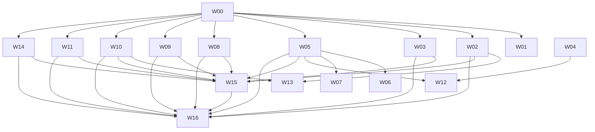

# Connector Campaign W00-C1：中性 Campaign 契约、架构/接口合同、DAG 与 Schema 规范

## 0. 文档元信息


- **权威输入**（本文档不得与之冲突；冲突记入 §9 `open_questions`）：
  - `catalog-evidence.json`（本 campaign 私有工作目录下的文件产出，1,005,103 字节；现已随本 PR 镶入本仓库 `docs/system-specs/connector-manifest/campaign-evidence/catalog-evidence.json`）
  - `code-audit.json`（本 campaign 私有工作目录下的文件产出，**未镶入本仓库**——审阅认定其在本 PR 范围内零消费者，按「需要它的那一轮再引」处置；本文档下方对其字段的引用指向该私有工作目录文件，不是本仓库内任何可解析路径，读者需回到 campaign 自己的工作产出才能核对）
- **本文档不包含**：任何 validator/CI 脚本代码、任何 runtime 实现代码、任何测试框架代码。凡涉及"如何检查"的内容，均以 schema 规范/规则描述形式给出，不写可执行代码。
- **命名约束**：全文仅使用 Kiro Crew、目标厂商官方产品名（如 GitHub、Gmail、Google Drive、SharePoint、Outlook、OneDrive、OneNote、Teams、Excel、Slack、Asana、Salesforce、Zoom——这些是目标厂商对自己官方一方接口的命名，命名规则允许）、以及三个中性需求分类 `baseline_alignment` / `production_requirement` / `user_extension`。不出现任何第三方 AI 助手/MCP 客户端产品名。
- **诚实性基线**（贯穿全文）：任何未验证的结论标 `unknown` 或 `gap`，不用推断填补；引用其他文件的结论必须注明来源文件+字段路径；"来源覆盖"（有官方文档/API 存在）不得说成"实现覆盖"（Kiro Crew 已经能调用）；任何数字都不得被误读为完成度——本 campaign 当前实装完成度为 **0**（见 §8）。
- **权威计数**（下方各节的最终值，供快速核对——推导过程见对应小节，不在此重复叙述历次修订过程）：`services[].operations[]` = 232；`services[].gaps[].demoted_operations_full_record[]` = 40；契约附件 = 1；232+40+1=273。`shared_contracts` 九族共 72 条 `contract_id`（AUTH 11 + GOV 7 + RUN 10 + KB 10 + ACL 9 + DATA 7 + UX 7 + SURF 6 + OPS 5）。§8 缺口章节采用三类显式标签（`EXTERNAL_BLOCKER` / `LOCALLY_INVESTIGABLE` / `SEQUENCING_DEPENDENT`），逐条打标签而非按章节隐含分类。

---

## 1. 中性 Campaign 契约（W00 required 范围的可重建索引）

### 1.1 如何重建完整 scope

本节**不复制**catalog-evidence.json 的 247 条 `required_acceptance_index` 或 273 条 operation 记录（232 条落在 `operations[]` + 40 条落在 `gaps[]` 降级记录 + 1 条契约附件，见下方逐路径计数）。完整 scope 的重建方法：

```
读取 catalog-evidence.json，按以下路径遍历（括号内为本文档核实的逐路径条数，供未来重建时核对是否遍历完整）：
  services[].operations[]                                    -- 逐服务、逐操作的能力条目（232 条：github 45 + gmail 29 + google_drive 23 + zoom 23 +
                                                                  teams 17 + outlook 13 + excel_shared_engine 11 + onedrive 10 + onenote 9 +
                                                                  sharepoint 6 + office_documents 6 + asana 28 + salesforce 12 + slack 0）
  services[].gaps[].demoted_operations_full_record[]          -- 被降级但仍需追踪的候选操作（40 条：slack 39 + asana 1；其余 13 个服务此路径均为 0）
  shared_contracts.microsoft_shared_auth_layer_note.operations[0]  -- M365 六服务共享认证层的契约附件（1 条，唯一一条，不落在上述任一 services[] 路径下）
  shared_contracts.{AUTH,GOV,RUN,KB,ACL,DATA,UX,SURF,OPS}[]   -- 9 大跨服务契约族，共 72 条 contract_id（AUTH 11 + GOV 7 + RUN 10 + KB 10 + ACL 9 + DATA 7 + UX 7 + SURF 6 + OPS 5）
  scenario_preconditions[]                                    -- 8 个跨服务 scenario 的前置条件
  performance_preconditions                                   -- 性能阈值来源（measurement_status=NOT MEASURED）
  required_acceptance_index[]                                 -- 247 条双轴索引（evidence_status × implementation_status），
                                                                  每条指回上述某个 operation_id 或 contract_id
```

**校验关系**（供未来 agent 核对自己的遍历是否完整，非新增结论，全部可从上表加总验证）：232（`operations[]`）+ 40（`gaps[]` 降级）+ 1（契约附件）= 273 = `coverage.total_operations_all_tiers_combined_including_contract_attachment`；232 + 40 = 272 = `coverage.total_operations_all_tiers_combined`（该字段口径**不含**契约附件，见 catalog-evidence.json `coverage.contract_attachment_operations.counted_in_evidence_tier_totals=false`）。若未来重建时只遍历 `services[].operations[]` 单一路径，只会取到 232 条——**必须同时遍历 `gaps[].demoted_operations_full_record[]` 和契约附件路径**才能得到完整的 273 条 operation 全集；这是 round-3 conductor 指出的曾经的错误（之前误把 `services[].operations[]` 单一路径标成 273 条），本表已改为逐路径列出精确计数，不再有任何单一路径被误标为总数。

任何未来上下文丢失后的 agent，只需重新读取这一份 JSON 文件、按上表逐路径遍历（不是只读一条路径），即可恢复完整 required 范围；本节只固定"范围的骨架和入口+每条路径应有多少条"，不固定条目本身的内容（内容以 catalog-evidence.json 为唯一权威源，本文档只是索引层）。

### 1.2 12 服务 + Office 的范围骨架

`services[]` 数组含 14 个 `service_id`（catalog-evidence.json 行 1620 起），按 `source_verified_strict` operation 数排序：

| service_id | source_verified_strict | search_snippet_or_partial | unverified | 备注 |
|---|---|---|---|---|
| github | 45 | 0 | 0 | |
| gmail | 29 | 0 | 0 | |
| asana | 28 | 0 | 1 | 1 条为 get_workspace_agents/get_agent，端点存在但 schema 未独立抓取 |
| google_drive | 23 | 0 | 0 | |
| zoom | 23 | 0 | 0 | |
| teams | 17 | 0 | 0 | |
| outlook | 13 | 0 | 0 | |
| excel_shared_engine | 11 | 0 | 0 | Graph Excel API，SharePoint/OneDrive 共享同一操作族，非独立 BI 引擎 |
| onedrive | 10 | 0 | 0 | |
| onenote | 9 | 0 | 0 | |
| sharepoint | 6 | 0 | 0 | |
| office_documents | 6 | 0 | 0 | docx/pptx OOXML 结构化编辑，跨 Graph 之外的格式规范 |
| slack | 0 | 0 | 39 | **全部 39 条降级**：research pass 自认未做任何 live fetch，见 §1.4 |
| salesforce | 0 | 12 | 0 | developer.salesforce.com 返回 HTTP 403，仅 search-snippet 佐证 |
| （contract-attachment，不计入任何单一 service） | 1 | | | `shared_contracts.microsoft_shared_auth_layer_note.operations[0]`，M365 六服务共享认证层 |

**总计**：`source_verified_strict`=220，`search_snippet_or_partial`=12，`unverified`=40，合计 272（不含 attachment）；含 attachment 为 273。此为 catalog-evidence.json `coverage.operations_by_evidence_tier` 的直接引用，**不是**本文档推导的数字。

Office 能力（`office_documents` + `excel_shared_engine`）不是独立第 13 个"服务"，而是横切 SharePoint/OneDrive（存储位置）与 docx/pptx/xlsx（格式）两个维度的能力集合——重建时注意不要把它当成与 12 服务并列的第 13 个 provider id。

### 1.3 九大 shared_contracts 族索引

| 族 | contract_id 范围 | 条数 | mission_brief_clause 覆盖 |
|---|---|---|---|
| AUTH | AUTH-01 … AUTH-11 | 11 | [1]-[12]，含两次声明合并（AUTH-08 合并 [10]+[11]）与两次补漏（AUTH-10=[3], AUTH-11=[8]） |
| GOV | GOV-01 … GOV-07 | 7 | [1]-[7]，1:1，无补漏 |
| RUN | RUN-01 … RUN-10 | 10 | [1]-[10]，1:1，无补漏 |
| KB | KB-01 … KB-10 | 10 | [1]-[10]，含一次声明合并（KB-01 合并 [1]+[2]）、一次声明拆分（KB-08/KB-09 拆分原 [9]）、一次补漏还原（KB-10 还原被拆分位移的原 [10]） |
| ACL | ACL-PUBLISH-MATRIX, ACL-02 … ACL-09 | 9 | [1]-[9]，初版仅建 1 条（覆盖 [1]），事后补齐 [2]-[9] 共 8 条 |
| DATA | DATA-01 … DATA-07 | 7 | [1]-[7]，含一次拆分（DATA-05 原含 [6]+[7]，拆出 DATA-07=[6]）、两条补漏（DATA-06=[4], DATA-07=[6]） |
| UX | UX-01 … UX-07 | 7 | [1]-[7]，1:1，无补漏 |
| SURF | SURF-01 … SURF-06 | 6 | [1]-[6]，1:1，无补漏 |
| OPS | OPS-01 … OPS-05 | 5 | [1]-[5]，1:1，无补漏 |

**合计 72 条 contract_id**（11+7+10+10+9+7+7+6+5）。这是 catalog-evidence.json `meta.clause_coverage_note` 自述的补漏过程的直接结果，本文档只做索引，补漏逻辑本身以该 note 为权威源，不在此复述细节。

九族逐条内容（title/description/evidence/gaps/mission_brief_clause）全部在 §2 的架构合同章节按需引用，不在此重复。

### 1.4 8 个跨服务 scenario 索引

`scenario_preconditions[]`（catalog-evidence.json 行 14122-14221）：

1. `gmail_to_asana` —— Gmail 消息触发 Asana 任务创建
2. `outlook_to_zoom_to_slack` —— Outlook 日历事件 → Zoom 会议 → Slack 通知
3. `sharepoint_onedrive_excel_outlook` —— SharePoint/OneDrive Excel 工作簿读写 → Outlook 邮件
4. `drive_sharepoint_to_kb_to_app_with_revoke` —— Drive/SharePoint 内容摄取 KB → App 呈现 → 撤权（本 campaign 安全关键度最高的 scenario，明确标注"explicitly left BLOCKED for live verification rather than asserted as working"）
5. `github_to_slack_or_teams` —— GitHub 事件 → Slack/Teams 通知
6. `salesforce_to_excel_or_drive_preserving_fls` —— Salesforce 查询结果导出至 Excel/Drive，保留 FLS
7. `zoom_to_onenote_or_asana_with_pending_state` —— Zoom AI 摘要/录制 → OneNote/Asana，处理异步 pending 态
8. `office_docx_pptx_roundtrip` —— 远程 docx/pptx 下载→编辑→回传，客户端侧 OOXML 重写

每个 scenario 的 `preconditions[]`/`gaps[]` 字段是权威内容，本文档不复制，仅索引 `scenario_id` 供重建。

### 1.5 性能前提（不得编造实测数字）

`performance_preconditions.measurement_status = "NOT MEASURED in this investigation-only pass"`。已知信息**仅**是厂商文档标注的**配额上限/ceiling**，不是 Kiro Crew 侧实测吞吐/延迟：

| provider | 厂商文档配额 |
|---|---|
| github | 认证 REST 5,000 req/hour/user（GHE Cloud 自有 App 可达 15,000）；次级限制 900 REST points/min、2,000 GraphQL points/min、100 并发、90s CPU/60s wall |
| slack | Tier 1-4 分级限流（具体数值本轮未逐档重新核实） |
| google_drive | 可续传上传会话 TTL 1 周；非末尾分片须 256KB 对齐 |
| sharepoint | ≥250MB 文件强制使用可续传会话 |
| asana | MCP `create_tasks` 单批最多 50 条 |
| salesforce | SOQL 默认分页约 2000 条（`queryMore`/`nextRecordsUrl`） |

`hardware_data_volume_concurrency_thresholds`（并发数、数据量、硬件阈值）= **NOT ESTABLISHED**，无负载测试被执行或设计。任何未来给出的具体阈值数字，必须先记录来源（厂商文档 vs 独立压测）与批准门槛，不得直接采用本节配额数字作为 Kiro Crew 侧承诺。

---

## 2. 完整 DAG

### 2.1 DAG 边定义（依赖的是具体契约/接口，非流编号空箭头）

```
W00 ─┬─(72 条 contract_id 全集 + 273 条 operation 全集：232 落在 operations[] + 40 落在 gaps[] 降级记录 + 1 条契约附件，见 §1.1 逐路径计数)──> W01
     ├─(shared_contracts.AUTH-01..11 + connections/{mint,warm,status,ownership,registry}.py 生命周期机器)──> W02
     ├─(shared_contracts.GOV-01..07 + connections/registry.py 的 launch_gate_passed/get_visible_providers() 门控模型)──> W03
     ├─(shared_contracts.RUN-01..10 + 统一 typed error taxonomy 规范，§4)──> W05
     ├─(shared_contracts.KB-01..10 + knowledge/connectors/{base,local_folder}.py 的 BaseConnector 复用契约)──> W08
     ├─(shared_contracts.ACL-PUBLISH-MATRIX..09 + 两账号差分测试规范)──> W09
     ├─(shared_contracts.UX-01..07 + registry.py 的状态词表/可见性计算)──> W10
     ├─(shared_contracts.SURF-01..06 + MCP 工具 on-demand discovery 模式)──> W11
     └─(shared_contracts.OPS-01..05 + registry 的 launch-gate/一次性 app 注册边界)──> W14

W05 ─┬─(RUN-01 统一 error taxonomy 的落地实现，供下游消费)──> W06
     └─(RUN-02..05 的分页/并发/幂等具体机制，供下游消费)──> W07

W04 + W05 ─(W04 定义的具体机制 + W05 的 error taxonomy 共同构成 W12 所需的运行时基座；W04 本身不在本文档 W00 权威输入范围内，其内容与边界由后续 conductor 决定，此处只声明 W12 对 W05 的依赖部分)──> W12

W02 + W10 ─(W02 的 OAuth/账号绑定状态 + W10 的状态词表 UX 契约，共同构成 W13 所需的账号/UX 联动基座)──> W13

各 ready 能力（即 required_acceptance_index 中 implementation_status 达到"已实装并通过验收"的条目全集，当前为 0 条）──(逐条 operation/contract 通过其自身验收标准)──> W15

全部 live 服务（W02/W03/W05/W08/W09/W10/W11/W14 各自达到其 ready 判据）+ W15 ──(W15 的整合层完成)──> W16
```

### 2.2 每条边的具体依赖说明

| 边 | 依赖的具体契约/接口（不是流编号） |
|---|---|
| W00→W01 | W01 消费本文档 §1 的完整 required 范围索引（247 条 acceptance index + 72 条 shared_contract + 8 个 scenario）作为其自身范围定义的输入；W01 不得重新发明范围，只能引用。 |
| W00→W02（OAuth/connector 实现流） | AUTH-01..11 全部 11 条契约文本；`src/kiro_crew/connections/{mint,warm,status,ownership}.py` 的既有生命周期机器（mint→warm→status→ownership 四段，见 §3.2）；`registry.py`/`registry.json` 的 Provider TypedDict schema（见 §4.1）。**不含** PR #9992（`oauth_clients.py`）——该 PR 未合并且未经 diff-content 审查，DAG 边不得写成"依赖 #9992"，只能写"待核实其 diff/接口/owner/head/base/生命周期后确定"（见 §8.1.9 PR #9992 处理）。 |
| W00→W03（治理流） | GOV-01..07 全部 7 条；`registry.py` 的 `get_visible_providers()`/`get_tier()`/`launch_gate_passed`/`vendor_approval_pending` 门控字段实际读法（code-audit.json `reuse.reusable[3]` 已确认字段真实存在，非本文档推断）。 |
| W00→W05（运行时/错误处理流） | RUN-01..10 全部 10 条；本文档 §4.2 的 provider-capabilities discovery schema 规范（发现层要先于错误映射存在）。 |
| W05→W06 | RUN-01 的统一 typed error taxonomy（auth/scope/consent/not-found/forbidden/quota/throttle/conflict/input/temporary/partial/ambiguous 12 类）落地为具体模块后，W06 才能消费统一错误形态，而不是各自映射各厂商原生错误。 |
| W05→W07 | RUN-02（分页契约逐操作检测）、RUN-03（限流分桶）、RUN-04（写操作幂等）、RUN-05（ETag/SHA 并发+逐项 batch 结果）四条契约的具体机制敲定后，W07 才能实现依赖这些机制的具体 operation 执行层。 |
| W08 | KB-01..10 全部 10 条；`knowledge/connectors/{base,local_folder}.py` 的 `BaseConnector` 4 方法契约（`fetch`/`detect_changes`/`validate_config`/`source_type`）+ `dashboard/handlers/knowledge.py` 的注册字典 + `platform/interfaces.py` 的 `extra_connectors()` 扩展缝（见 §3.2 详述）。**不是重造**——W08 的任何新 connector 必须实现该协议，不得另建协议。 |
| W09 | ACL-PUBLISH-MATRIX..09 全部 9 条；两账号差分测试的规范形状（见 §7 EvidenceReceipt 设计）。 |
| W04+W05→W12 | W04 内容不在本 leaf 权威输入范围内（本文档不得凭空定义 W04），此边只声明 W12 对 **W05 产出**（RUN 族落地机制）的依赖部分；W04 部分的依赖内容留给 conductor 在派发 W04 时另行定义，本文档不越权代写。 |
| W02+W10→W13 | W13（多账号/多 provider 交互层）需要 W02 产出的账号绑定状态（AUTH-05 的 verified subject/tenant/account binding 具体机制）与 W10 产出的状态词表（UX-02 的 10 态封闭词表）两者都具体落地后才能开工，不是抽象地"依赖 W02 和 W10"。 |
| ready 能力→W15 | 每条 operation/contract 必须先各自通过其自身的 acceptance 标准（即 `required_acceptance_index` 对应条目的 `implementation_status` 从 `not_implemented` 变为已验收），W15 才能整合该条能力；不是等某个批次全部完成才整合，是逐条 ready 即可流入 W15。 |
| 全部 live+W15→W16 | W16 是最终整合，依赖 W02/W03/W05/W08/W09/W10/W11/W14 每一个自身宣布 ready（其 owner 定义的 ready 判据，本文档不代为定义）+ W15 完成其整合职责。 |

### 2.3 DAG 图（Mermaid，仅用于可视化，非可执行代码）



（Mermaid 代码块是文档标记语言，不是 runtime 代码、validator 或 CI 脚本，未违反本 leaf 的非编码边界。）

---

## 3. 架构合同与数据模型

### 3.1 binding / 受信 owner / 调用链 / 迁移 / 文件 owner 边界

来源：`code-audit.json` `file_ownership[]` + `reuse.reusable[]`（本节为直接引用与整理，非新推断）。

**共享模块必须单 owner** 的文件清单（`file_ownership[]` 原文）：

| path_glob | 建议 owner stream | 边界规则（原文摘录，非改写） |
|---|---|---|
| `src/kiro_crew/connections/**` | OAuth/MCP-connector stream | SHARED，真实冲突风险。当前有 PR #9992（未合并，仅读过文件名列表，未读 diff 内容）和 PR #10545（小改动）同时编辑此处。**第三方并发编辑者在开工前需要 conductor 级别决策**（基于对 #9992 的实际 diff-content 阅读），不能假设 #9992"安全可以在其上构建"或"安全可以忽略"。 |
| `src/kiro_crew/knowledge/connectors/**` | knowledge-base/dataset-ingestion stream | 既有已合并模块（`base.py`+`local_folder.py`+`__init__.py`，在 base_sha `89b63404b` 上确认存在），非单一未合并文件。新 connector 是新增文件实现 `BaseConnector`，注册进 `dashboard/handlers/knowledge.py` 的 connectors dict，低冲突风险。PR #8985（`bedrock_kb.py`）是同一模式的兄弟新增，若同期添加另一 provider 需与其作者协调。 |
| `src/kiro_crew/knowledge/{readers,ingestion,chunker,extractor,dedup}.py` | knowledge/dataset-ingestion stream | SHARED 核心文件（`readers.py` 有开放 PR #9401 涉及 DOCX 表格处理）。新 reader（如 xlsx）应新增至既有 reader-dispatch 模式，不得未经单一 owner 协调重构 `ingestion.py`（102KB，是每个现有 source type 的负载承载核心）。 |
| `src/kiro_crew/mcp_tools/*.py` | 匹配具体域的 stream（connector 工具→connector stream；knowledge 工具→knowledge stream） | 既有"每域一文件"惯例已隐含按文件 owner；新 connector 相关工具模块是新增文件，不需触碰既有兄弟文件。 |
| `src/kiro_crew/dashboard/handlers/{connections,secrets,mcp,knowledge}.py` | 匹配各 handler 前置的后端模块 | `connections.py` 和 `secrets.py` 均被开放 PR #9992 触及——SHARED，该 PR 解决前单一 owner。 |
| `src/kiro_crew/security_posture.py` | 跨域安全/治理 owner（非某个 connector stream 专属） | 同时被 #9992（connections）和 #8985（Bedrock KB）独立触及——是跨切面共享登记点，应由单一安全向 owner 审核合并所有 connector stream 的编辑，而非各 stream 各自独立编辑。 |
| `docs/system-specs/modules/connections.md` | connector stream | 与 `connections/**` 同一 owner；AGENTS.md 要求同一 commit 内更新此文档。 |
| `docs/system-specs/modules/knowledge.md` | knowledge/dataset stream | 同上规则，限定在 `knowledge/**`。 |
| `website/src/pages/connections/**` 及 `website/src/pages/settings/{ConnectionsPanel,SecretsPanel}.tsx` | connector stream 前端 owner | 与开放 PR #9992 的前端改动 SHARED，编辑前需协调。 |
| `website/src/pages/knowledge/**` | knowledge/dataset stream 前端 owner | `SourcesList.tsx` 被开放 PR #8985 触及，编辑前需协调。 |
| `website/src/i18n/locales/*.json` | 无单一 stream（机械化同步） | 每个 UI 相关 PR 都会触及所有 11+ locale 文件，不是真实所有权冲突风险；仅当两个 campaign PR 同时改动**同一新字符串 key** 时才需标记。 |

### 3.2 复用基线：既有 `connections/` 子系统与 `BaseConnector` 协议

**这是复用基线，不是重造对象**（seed 明确要求，本节直接落地）。

**OAuth/MCP-connector 生命周期机器**（`src/kiro_crew/connections/{mint,warm,status,ownership,registry}.py`，全部已合并于 base_sha）：

- `registry.py` + `registry.json`：Provider TypedDict 定义的类型化 provider 目录，含 tier（1-3 发布门控）、DCR vs 预注册客户端（`l0_expectations.dcr`）、推荐 scope、revoke 页面 URL、UI 卡片用的 gotcha/prerequisite 文案、smoke-test fixture、跨 provider 工具名冲突的 `tool_aliases`。当前约 28 个 provider 条目。**新增 provider 应在此新增行，而非另建平行 registry**；`category` 字段已支持分组展示。
- `mint.py`：spawn 专属 kiro-cli session 获取 consent URL，轮询至 granted/failed/expired。
- `warm.py`：预启动进程，Connect 时直接认领以降低延迟。
- `status.py`：本地授权存在性 stat 检查、connected-since 追踪、SEL 审计。
- `ownership.py`：Disconnect 的 census/judge/purge-and-revoke 事务，特意从 HTTP handler 中拆出以独立演进。

**关键结论**：任何新 provider 加入 `registry.json` 即自动获得这整套生命周期，无需为每个 provider 重写 mint/status/disconnect 代码——这是本 campaign 最大的复用机会。**但**（`code-audit.json` `reuse.reusable` 明确指出）：注册一行 registry 条目本身**不等于**完整可用——身份/scope 协商、refresh-token 生命周期、实际可用性都依赖 mint/status/ownership 机制针对该具体 provider 端到端跑通；`launch_gate_passed`/`vendor_approval_pending` 字段证明一个已注册条目可以无限期处于 gated/unverified/vendor-blocked 状态。**只加 registry 行 = 目录列表，不 = 交付了可工作的 connector。**

**知识库 connector 协议**（`src/kiro_crew/knowledge/connectors/{__init__,base,local_folder}.py`，已在 base_sha 确认存在并已合并，非本文档推断）：

`BaseConnector`（`base.py`，直接读取源码确认）：

```
class BaseConnector(ABC):
    """Base class for remote source connectors."""

    async def fetch(self, source: dict) -> tuple[str, dict]         # 返回 (text_content, metadata)
    async def detect_changes(self, source: dict) -> bool            # 是否有变化
    def validate_config(self, config: dict) -> tuple[bool, str]     # 返回 (is_valid, error_message)，同步方法
    def source_type(self) -> str                                    # dispatch key，docstring 给出的示例是 'quip'/'sharepoint'/'url'
```

**契约粒度的准确边界（round-2 纠正，不得夸大）**：`BaseConnector` 的 4 个方法本身是**单文档 + 整源级布尔**的粒度，不是逐条目/带 ACL 的同步协议：

- `fetch(source: dict) -> tuple[str, dict]`——取的是**一份文档**的文本+metadata，方法签名里没有游标、没有条目 ID 列表、没有"从哪个点继续"的概念。
- `detect_changes(source: dict) -> bool`——返回的是**整个 source 是否变化**的单一布尔值，不是"哪些条目变了/哪些删了"的逐条目 delta。

**这个协议本身没有**：逐条目 delta cursor、ACL/权限面、删除事件、permission tombstone。这四项都是空白，不是"已有但弱"。

**关键结论（收窄后的准确表述）**：`BaseConnector` 的 docstring 明确写"remote source connectors"，`source_type()` 的 docstring 给的示例也全是远程源（quip/sharepoint/url），这证明**抽象层的命名意图**对准了远程源，不是本地文件夹的偶然延伸。**但命名意图不等于同步语义已具备**——`source_type()` docstring 里出现 `sharepoint` 只说明"这个协议将来打算被 SharePoint 这类远程源实现"，不代表 SharePoint/Google Drive/OneDrive 这类云 KB 可以直接套用现有的两个方法签名就取得完整同步能力。

**真正可复用的范围，精确到止**：是**注册与 dispatch 缝**——`dashboard/handlers/knowledge.py` 建立 `connectors: dict[str, BaseConnector]` 字典 → `extra_connectors()` 扩展缝合并 edition 自带条目 → `SyncScheduler` 按该 source 行自己的 `source_type` 查表分发调用。这条缝本身是通用的，新 provider 接入这条缝不需要改 `sync.py`/`dashboard/handlers/knowledge.py` 的现有逻辑。

**不可复用、必须真实新建的部分**：Google Drive/SharePoint/OneDrive 这类云 KB 若要满足 KB-03（enumeration/content/metadata/delta/ACL/deletion + tombstone/checkpoint）、KB-04（resourceID+version、rename/move/cursor-invalid 处理）、KB-10（provenance/rebuild/remove/revoke/cache 一致失效），**必须在 `fetch`/`detect_changes` 之外新增**：逐条目 delta + cursor 追踪、ACL/权限快照 + permission tombstone 生成、checkpoint 仅在整轮成功后推进的规则。这些是 `BaseConnector` 现有两个方法完全不覆盖的新协议层，不是对现有方法的参数扩展就能补齐的——本文档不得、也未曾声称这层已经存在。

**注册与调用链**（直接读取 `dashboard/handlers/knowledge.py` 与 `knowledge/sync.py` 源码确认，非转述）：

```
启动时：connectors: dict[str, BaseConnector] = {}
        connectors["local_folder"] = LocalFolderConnector()
        connectors["obsidian_vault"] = LocalFolderConnector()   # 同一个类，两个 source_type key
        扩展缝：current_context().knowledge.extra_connectors(ctx.cfg)
                -> 返回 {source_type: BaseConnector}，合并进 sync map
                -> 内建条目先注册，edition 可新增或覆盖
                -> 包在 safe_context_call：adapter 出错时降级为仅内建（fail-open on error）
                -> 独立/公开版 edition 返回 {}
        connectors 传入 SyncScheduler(store, pipeline, connectors)
运行时：SyncScheduler.get_connector(source_type) -> connectors.get(source_type)
        sync_source() 按该 source 行自己的 source_type 查表调用
```

**新 connector 的正确扩展点**：新写一个实现 `BaseConnector` 4 方法的类，注册进 `dashboard/handlers/knowledge.py` 的 connectors 字典（若应在独立/公开 edition 出货）或通过 `extra_connectors()` 扩展缝（若限定 edition）。**这是已验证、已生效的扩展点**，不是"目前无既有协议"的情况——`code-audit.json` 明确记载过早期版本的错误结论（"只有一个未合并文件"）已被纠正为"已合并、已注册、已调度的真实协议"。

### 3.3 凭据托管边界（AUTH-01）：两种 custody 严格分开，不得混为一谈

`code-audit.json` `reuse.reusable` 记载了一次自我纠正，round-2 conductor 裁决再次要求以**两个独立类别**呈现，本节按此结构重写，两类之间不共享判断逻辑：

**类别 A —— 新原生 trusted owner custody（允许）**

- 定义：一个新的原生 API 集成（例如使用长期有效 API key，而非既有 MCP OAuth 授予）持有该 provider 的凭据。
- 允许条件（三者缺一不可）：(1) 一个清晰标识的、明确受信的 OWNER；(2) backed by一个**新的**授权授予（不是复用任何既有授权）；(3) 该托管安排本身经过安全设计评审并被批准。
- 三者齐备时，这种托管**不**被 AUTH-01 禁止——AUTH-01 不禁止"trusted custody"这个类别本身。
- 谁来批准：campaign owner 的治理决策，本审计/本文档都无权预先批准或排除任何具体安排。

**类别 B —— 旧 MCP token custody 的读取/复用（绝对禁止）**

- 定义：读取或复用一个**既有** MCP OAuth token（即已经因为另一个目的被授予、正在被 kiro-cli 自己端到端持有的 token）用于新目的。
- 状态：**绝对禁止，无例外条件，不存在"经批准后可以"的路径**——这是硬线，不是"类别 A 的批准流程走一遍也能解禁"的软约束。
- 既有 `connections/` 子系统的自身设计已经是这条硬线的具体实现：kiro-cli 自己端到端拥有 OAuth token 链，Kiro Crew 后端只对授权存在性做 stat，从不打开 token 字节。若新 connector 复用该子系统的 mint/status/ownership 机器（DCR 或预注册客户端 OAuth provider），它继承并**必须保持**这一设计，没有自选空间。

**两类之间唯一的关系**：类别 A 和类别 B 讨论的是两个不同的动作（"新建一个新的受信托管安排"vs"复用一个既有的 token"），不是同一件事的两种严格程度。判断一个具体设计属于哪一类，只需回答"这个凭据的授权授予是新的、还是复用自某个已存在的 MCP OAuth 授权"——答案是"新的"走类别 A 的批准路径，答案是"复用既有"直接归类别 B，禁止，没有第三种情况。

### 3.4 两条独立演进的 OAuth 模式（未解决的架构决策）

`code-audit.json` `reuse.new_required` 记载：除中央 `connections/` registry+mint 模式外，还存在 PR #8081（`apps/builtins/meetings/backend/{credentials,oauth}.py`）这样一条**独立于** `connections/registry.py`/`mint.py` 的、app 局部的自定义 OAuth 实现。这是一个**留给 campaign owner 的开放决策**，本文档不代为解决：新增 N 个 provider 是否统一走 `connections/`（推荐，因为那里有成熟的生命周期机器），还是接受 app 局部自定义 OAuth 作为 meetings/calendar 这类特例的第二种被认可模式。记入 §9 `open_questions`。

### 3.5 迁移机制

`code-audit.json` `build_test_migration.migration_mechanism`：**未深入调查**（本 leaf 时限所限）。AGENTS.md 的 router 指向 `docs/system-specs/modules/config.md` 描述 `config.json` 写入/迁移机制，但未找到针对 connections-registry schema 变更的专门迁移文档。标记为 `gap`，非本文档虚构结论。

---

## 4. Manifest 的 Schema 规范（文档形式，非 validator 实现）

本节只写字段规范。**不写任何 validator 代码**。任何"检查逻辑"均以自然语言规则描述，供未来实现阶段的编码 leaf 参照，不在此 leaf 产出。

### 4.1 每个 required operation 的字段规范

每条 required operation（对应 `catalog-evidence.json` `services[].operations[]` 或 `required_acceptance_index[]` 的一条）在 manifest 中的字段定义：

| 字段 | 类型 | 必填 | 规范说明 |
|---|---|---|---|
| `operation_id` | string | 是 | 稳定 ID，跨 campaign 各阶段不可变更（catalog-evidence.json 已按此惯例命名，如 `gh_search_repositories`） |
| `provider` | string | 是 | 厂商标识（如 `github`），对应厂商官方 API/产品自身命名，非中性 service_id |
| `service_id` | string | 是 | 中性服务范围标识（如 `github`/`gmail`/`excel_shared_engine`），14 个既定值之一 |
| `required` | boolean | 是 | 是否为本 campaign 必需能力 |
| `category` | enum | 是 | 三值之一：`baseline_alignment` / `production_requirement` / `user_extension`（**不缩减 scope，只换名**） |
| `source` | object | 是 | `{source_kind, source_id, observed_at, snapshot_ref}`——`source_kind` 取值需在 `official_docs`/`repo_path`/`format_spec`/`search_snippet_corroborated` 之一，`snapshot_ref` 指向可复核的具体 URL 或本地路径+版本 |
| `observed_at` + `snapshot_ref` | string | 是 | 观察日期与快照引用，允许未来对比厂商文档漂移 |
| `effect` | enum | 是 | 封闭效果词表：`read`/`write`/`delete`/`share`/`external_send`/`admin`/`billable`（对齐 GOV-02） |
| `io_schema_version` | string | 是 | 输入/输出 schema 自身的版本号，允许独立于厂商 API 版本演进 |
| `auth_modes` | array/object | 是 | 该操作支持的认证模式列表（如 `oauth_user`/`fine_grained_pat`/`service_to_service`），必须逐操作声明，不得假设整个 provider 统一 |
| `scopes` | array | 是 | 该操作所需的最小厂商侧 scope（对齐 AUTH-02，不得请求超出所需的宽泛 scope） |
| `account_types` | array | 是 | 支持的账号类型（如 `personal`/`organization`/`enterprise_cloud`/`work_school`） |
| `surfaces` | array | 是 | 该操作可从哪些入口触达（chat/App/workflow/background），对齐 SURF-06 |
| `policy` | object | 是 | 该操作的治理策略挂钩点（对齐 GOV-01 的 platform∩workspace∩session∩connection∩provider 交集模型），本字段不写具体策略值，只声明挂钩结构 |
| `pagination` | string | 视情况 | 若为 list/search 类操作必填；须逐操作声明具体分页契约（page/perPage、cursor、`@odata.nextLink`、`queryMore` 等），**不得假设同一 provider 内所有操作共享一种分页契约**（对齐 RUN-02 的已确认跨/内部不一致发现） |
| `retry` | object | 视情况 | 幂等/重试策略挂钩（对齐 RUN-04），须声明该操作实际具备的幂等机制类别：`base_sha_guard` / `generate_ids_preallocation` / `external_id_upsert` / `none_verify_by_readback`，**不得声明通用 exactly-once** |
| `adapter` | string | 是 | 实现该操作的适配器模块路径占位（本 leaf 不填具体路径，留给实现阶段） |
| `code_refs` | array | 视情况 | 指向复用基线的具体代码路径（如 §3.2 的 `connections/mint.py`），供实现阶段直接定位 |
| `verification_contract` | object | 是 | 见 §6 EvidenceReceipt 设计，此处只放该操作对应的可重放性/负向测试要求指针 |
| `status` | enum | 是 | 当前实装状态，取值须与 `required_acceptance_index.implementation_status` 同源：`not_implemented`（campaign 当前**全部**247 条均为此值）/ 未来允许的其他值由实现阶段定义，本 leaf 不预先创造 |
| `blocker` | object 或 null | 视情况 | 见下方 blocker 结构 |

**blocker 结构规范**：

```
blocker: {
  reason: string        // 如 "BLOCKED_POLICY" / "no_live_fixture_account" / "no_console_registration"
  owner: string          // 谁能解除，对齐 blocked_capabilities[].owner 的既有写法
  unblock_action: string // 具体解除动作，对齐 blocked_capabilities[].unblock_action 的既有写法
}
```

### 4.2 provider-capabilities discovery 的输入输出 schema 规范（与目标 baseline 映射分节）

**本节与 §4.1 的"目标 baseline 映射"是两件不同的事**，不得混为一节（seed 明确要求）：

- §4.1 回答"Kiro Crew 认为这个 provider *应该*支持哪些 required operation"（静态 manifest，人工维护+版本控制）。
- 本节回答"Kiro Crew *如何在运行时发现*一个 provider 实际广播了哪些能力"（discovery 协议，运行时探测）。

**Discovery 输入 schema**：

```
discovery_request: {
  provider: string              // 目标 provider 标识
  account_binding: string       // 已验证的账号/tenant 绑定引用（不得为空，对齐 AUTH-05）
  requested_scope_hint: array   // 可选，用于缩小探测范围
}
```

**Discovery 输出 schema**：

```
discovery_response: {
  provider: string
  observed_at: timestamp
  scope_snapshot: array          // 本次探测时该账号绑定实际持有的 scope 集合
  capability_rows: [
    {
      operation_id: string | null   // 若能映射到 §4.1 manifest 中的已知 operation_id 则填，否则 null（表示厂商侧出现了 manifest 未覆盖的新能力，需人工登记）
      raw_capability_signature: string  // 厂商侧原始能力标识（如某个 REST scope 名或 MCP tool 名）
      matches_manifest: boolean
    }
  ]
  version_snapshot: string       // 厂商 API/MCP 服务自身版本标识，用于检测漂移
}
```

**与 baseline 映射的关系**：discovery_response 的 `capability_rows[].matches_manifest` 字段是**唯一**允许的映射关联点；除此之外，discovery 协议本身不包含任何 baseline 判断逻辑（判断逻辑属于实现阶段的 validator，本 leaf 不写）。若 `matches_manifest=false` 出现，须记入 gap，不得静默丢弃也不得自动写入 manifest。

## 5. Tenant-Readiness（账号类型、注册、无 secret）

本节汇总 12 服务 + Office 各自的租户准备要求。**不含任何 secret 值**——本节字段全部是"需要什么"的结构描述，不含任何具体 credential。

### 5.1 账号类型矩阵

| service_id | 账号类型（`account_types`，来自 catalog-evidence.json 各 operation 字段汇总） |
|---|---|
| github | personal / organization / enterprise_cloud |
| gmail, google_drive | 标准 Google 账号（consumer）/ Google Workspace（含 domain-wide delegation 场景，管理员侧配置） |
| sharepoint, outlook, onedrive, onenote, teams, excel_shared_engine | work_school（M365 租户）；OneDrive 另支持 personal（消费者版，权限形态更窄，见 §5.4） |
| slack | 单一 workspace 或 org 安装（本服务 0 条 verified operation，见 §8.1，此为契约层面的既有认知，非实测） |
| asana | 单一 workspace（MCP token 在授权时即绑定具体 workspace，跨 workspace 需独立 session） |
| salesforce | 单一 org（通过 My Domain 子域名） |
| zoom | 用户级 OAuth（绑定具体人）或 Server-to-Server OAuth（账号级，非绑定具体人） |

### 5.2 OAuth App Registration 路径

对齐 AUTH-03/OPS-03：GitHub 与 Asana 需要**一次性**预注册 OAuth/MCP app（无 Dynamic Client Registration）才能开始任何 connect 流程；这与随后的逐用户 OAuth consent 是两个独立的授权面。Kiro Crew 自己的 `connections/registry.py` 的 `Provider.client_id` 字段正是为此建模（仅非 DCR provider 存在该字段）。

**当前状态**（`kirocrew-connections-registry` source，`catalog-evidence.json` 直接引用）：`registry.json` 目前**仅有** GitHub 与 Asana 两条目，均 `tier=2`、`launch_gate_passed=false`（待完成 app registration）。**其余 10 个服务范围（Gmail/Google Drive/SharePoint/Outlook/OneDrive/OneNote/Teams/Slack/Salesforce/Zoom）在 registry 中完全不存在条目**。这不是这些厂商缺乏官方 MCP/API 面（官方文档独立确认它们都有），而是 Kiro Crew 侧尚未注册。

### 5.3 Callback

未在本轮独立验证任何具体 callback URL 配置细节（`AUTH-04` 契约标注：无任何服务在本轮执行过完整 live OAuth 流程）。**规范要求**：真实 callback 绑定 code+PKCE+state，服务到服务流程（Salesforce JWT-bearer/client-credentials，Zoom Server-to-Server OAuth）不使用 PKCE——这是这些流程的设计本质，不是缺陷（对齐 AUTH-04/AUTH-09）。

### 5.4 最小 Scopes/Consent

对齐 AUTH-02，每服务须请求**逐能力最小化**的 scope，不得一次性宽泛授权。已确认的具体最小化原则示例（`catalog-evidence.json` `shared_contracts.AUTH.AUTH-02.evidence`）：Gmail 场景下，仅搜索/读取用 `gmail.readonly`；仅发送用 `gmail.send`（非 `gmail.modify`）；仅标签 CRUD 用 `gmail.labels`（不涉及邮件内容访问）；仅草稿管理用 `gmail.compose`（不涉及全信箱读取/修改）。

**已知的权限形态不对称**（须在 tenant-readiness 检查表中体现，不得假设对称）：
- OneNote：**无**应用级权限形式，任何后台/daemon 场景都必须回退到委托流程。
- OneDrive personal 账号：多数 `Files.*` 操作**无**应用级权限选项，仅委托可用。
- Excel workbook session API：不支持 personal Microsoft 账号，也不支持纯应用级鉴权。
- Teams RSC：部分权限仅委托可用（如 `ChannelMeetingAudioVideo.Stream.Group`），部分仅应用级可用（如 `ChannelMessage.Read.Group`），是逐权限项非对称，不是统一规则。

### 5.5 Fixture Owner

`code-audit.json`/`catalog-evidence.json` 均确认：**本 campaign 当前没有任何真实、已授权的 fixture 账号**，0 个操作在任何服务上被 live 验证过。`ACL-PUBLISH-MATRIX` 要求的两账号差分测试（一账号可读、另一账号连 title/snippet/content/citation 都拿不到）需要**每个服务至少两个真实不同权限的账号**——目前无人被指定为这些 fixture 账号的 owner。**记入 §8 blocked，无 owner 姓名可填，等待 campaign owner 指定**。

### 5.6 License

已确认的 license/entitlement 门槛（非本文档编造，均来自各服务官方文档研究）：
- Asana `custom_fields`、`search_tasks` 为 Premium-only 功能。
- Zoom AI Companion 会议摘要功能的确切当前 license tier **未能锚定单一权威声明**（Zoom 该功能的定价框架多次调整），记为 gap，需未来 live 重新核实。
- Salesforce Reports/Dashboard、部分高级 API 可能有 Enterprise-only 门槛（具体条目未逐一穷举，本节不假装完整）。

规则重申（对齐 mission brief 原文与 `coverage.note_on_license_gating`）：**license/entitlement 缺失不得被记成"不支持"从而从 required 集合中静默移除**——必须保留为 required，附带明确的 `acceptance_precondition`/gap 说明门槛。

---

## 6. Live Conformance Runner 与 EvidenceReceipt 的 Schema/协议设计（设计，非实现）

本节**只设计协议形状**，不写任何 runner 代码、不写任何测试框架代码。

### 6.1 可重放性（Replayability）

规范要求：每次 conformance 运行必须产出一个可独立重放的记录，使第三方（不重新执行网络调用）能够复核该次运行判定的依据。字段设计：

```
ConformanceRun: {
  run_id: string                    // 唯一标识
  operation_id: string               // 对应 §4.1 manifest 中的一条
  account_binding_ref: string        // 指向 §6.2 受信 runner 使用的账号绑定，不含明文凭据
  executed_at: timestamp
  request_shape_hash: string         // 请求形状的哈希，不含实际参数值中的敏感数据
  response_summary: object           // 响应的结构化摘要（字段是否存在、类型是否匹配），不是完整响应体的无差别转储
  verdict: enum                      // pass / fail / inconclusive
  evidence_receipt_ref: string       // 指向 §6.4 EvidenceReceipt
}
```

### 6.2 受信 Runner 模型

规范要求（对齐 mission brief"不得在不受信 PR 上使用真实凭据"）：

- Conformance 运行**只能**由一个明确标识的受信 runner 身份执行，该身份与发起 PR 的作者身份**分离**——一个不受信/外部贡献者的 PR 不得携带触发 runner 使用真实凭据的能力。
- Runner 对凭据的访问遵循 §3.3 的托管边界：既有 `connections/` OAuth 凭据由该子系统自己的机制持有，runner 只能通过既有 mint/status 接口触达，不得绕道直接读取凭据文件。
- Runner 身份本身的验证机制（如何证明"这确实是受信 runner 而非伪造调用"）：**未设计**，标记为 open_question（见 §9），需要 campaign owner 决定采用何种绑定机制（类比本 campaign 已有的 KIROCREW_SESSION_KEY 可伪造教训，不得复用同一个弱绑定模式）。

### 6.3 Read-back

规范要求：任何写操作（`effect=write/delete/share/admin`）的 conformance 验证，必须在写入后执行一次独立的读操作核实结果，不得仅凭写操作本身返回的 200/201 状态码判定成功。Read-back 结果作为 `EvidenceReceipt` 的一部分记录。

### 6.4 EvidenceReceipt Schema

```
EvidenceReceipt: {
  receipt_id: string
  conformance_run_ref: string          // 指向 §6.1 的 ConformanceRun
  claim: string                         // 本次运行声称验证了什么（人类可读一句话）
  evidence_tier: enum                   // 复用 catalog-evidence.json 已定义的三档：source_verified_strict / search_snippet_or_partial / unverified，此处指"运行时验证"这一档外加的第四态：
  runtime_verified: boolean             // true 仅当本 receipt 是一次真实 live 调用的直接产物；false 表示这是设计阶段占位，不得被下游误读为已验证
  readback_result: object | null        // §6.3 的读回结果，写操作必填
  negative_test_refs: array             // 见 §6.5
  cleanup_confirmed: boolean            // 见 §6.6
}
```

### 6.5 负向测试规则

规范要求：每个 required operation 的 conformance 覆盖，除正向（预期输入→预期成功）外，必须至少设计以下负向场景之一（具体选哪个视该 operation 的 `effect` 与 `auth_modes` 而定，本节不强制全量穷举）：

- 权限不足场景（scope 缺失时应收到 `forbidden`/`scope` 类型化错误，而非静默降级或误报成功）
- ACL 拒绝场景（对齐 ACL-04：ACL API 本身不可用时必须 fail-closed）
- 幂等/重复请求场景（对齐 RUN-04：不得声称通用 exactly-once，需验证该 operation 实际具备的机制表现）

### 6.6 清理（Cleanup）

规范要求：任何在 conformance 运行中创建的测试态数据（如 GitHub 测试仓库、Asana 测试任务、Salesforce 测试记录），必须有对应的清理步骤，且清理结果本身要被验证（不能假设清理调用返回成功就是真的清理了——按 §6.3 read-back 同一原则，清理也需要读回确认）。`EvidenceReceipt.cleanup_confirmed` 字段即为此设计。

### 6.7 "不得在不受信 PR 上使用真实凭据"的具体落地

- 触发 conformance runner 的机制本身，不得由 PR 内容（如修改一个 workflow 文件）直接触发对真实账号的调用，除非触发者身份先通过 §6.2 的受信 runner 绑定检查。
- 本设计**不**规定具体 CI 系统实现细节（如"用 GitHub Actions 的哪个 trigger"）——那是实现阶段的技术选型，本 leaf 不越权代写。

---

## 7. Performance Workload 与固定阈值

**直接引用** `catalog-evidence.json` `performance_preconditions`，**不编造实测数字**：

- `measurement_status`: `"NOT MEASURED in this investigation-only pass"`——原文原样引用，无改写。
- 已知信息**仅**是厂商文档标注的配额（见 §1.5 表格，本节不重复）。
- `hardware_data_volume_concurrency_thresholds`: `"NOT ESTABLISHED"`——同样原文引用。

**阈值来源规则**（本节新增的规范，非 catalog-evidence.json 原文，但与其立场一致）：

1. 任何未来给出的具体阈值数字，必须标注来源：
   - `vendor_documented_ceiling`（厂商文档写明的硬性上限，如 GitHub 的 900 REST points/min）——这类数字可以直接引用，但仍要注明是厂商限制，不是 Kiro Crew 自己的承诺能力。
   - `measured_load_test`（Kiro Crew 自己跑的压测结果）——引用前必须附带测试环境描述（并发数、数据量、硬件规格、测试脚本版本），当前**没有任何**此类数字存在。
2. **独立调整规则**：厂商侧配额可能随时间变化（如 Zoom AI Companion 的 license/pricing 框架已多次调整），任何写入 manifest 的厂商配额数字需要定期重新核实的机制，本节不规定具体核实周期（留给实现阶段/campaign owner 决定），但要求每条厂商配额数字必须携带 `observed_at` 时间戳（复用 §4.1 的字段），使"这个数字是什么时候确认的"始终可追溯。
3. **批准门槛**：任何把厂商配额数字直接当作 Kiro Crew 自己的 SLA/容量承诺的决定，必须经过明确的人工批准（不能因为"厂商说 5000/hour"就自动写成"Kiro Crew 也承诺 5000/hour"——中间还有 Kiro Crew 自己的多租户分摊、并发限流桶等因素未被本轮验证）。

## 8. 进度数据规则

**完成度只能由 manifest/CI 生成，不得手写百分比。**

`catalog-evidence.json` `coverage.required_acceptance_index_summary.index_semantics_note` 的核心区分（本节直接落地此规则，不重新发明）：

- `evidence_status`（`source_verified` / `search_only` / `unverified` / `blocked`）衡量的是"这个需求的存在/形状有多可靠的依据"——**这不是完成度**。
- `implementation_status`（当前唯一值 `not_implemented`，覆盖全部 247 条）衡量的是"这个能力是否已经被构建并通过 live 验收测试"——**这才是唯一允许换算成完成度百分比的字段**。
- 任何人（包括未来的实现阶段 agent）从 `evidence_status` 分布（`source_verified`=176, `search_only`=10, `unverified`=36, `blocked`=25）计算出类似 176/247=71% 这样的比例，**都是在计算"来源可信度比例"，不是"完成度"**，绝不能这样呈现。
- **当前 campaign 实装完成度 = 0**——这是直接陈述，不是从 `evidence_status` 推导出来的。因为 `implementation_status_distribution` 里 247 条全部是 `not_implemented`，247/247=100% 未实装，等价于 0% 已实装。这是本 W00 阶段的范围（investigation-only，无生产代码，无 PR，见本 leaf 自己的决策边界），不代表未来阶段。

### 8.1 缺口分三类，逐条打标签，不得混列（round-3 再次纠正）

round-2 已尝试拆两节，但仍有分类错误未纠正——**round-3 conductor 指出**：Slack 0 验证操作的真实成因是"研究 pass 根本没做 live fetch"，不是"站点封锁"，因此它属于本地可做（任何有 web_fetch 权限的 leaf 重跑即可），不应归 `EXTERNAL_BLOCKER`；PR #9992 的 diff-content 阅读同理——阅读一个已公开 PR 的 diff 不需要任何本地不具备的权限，只是这一轮的范围未覆盖。本节改为**逐条显式打标签**（不再靠归入哪一节隐含分类），三类定义：

- **`EXTERNAL_BLOCKER`**：本地无论投入多少本轮可用的时间/工具都无法自行解除，必须等待外部动作（厂商侧审批、用户本人操作、fixture 账号提供、厂商网站解除 bot-blocking 等）。
- **`LOCALLY_INVESTIGABLE`**：本地工具/权限范围内本可以做，只是本轮因预算/范围选择未做——下一轮不需要等任何外部条件即可直接执行。
- **`SEQUENCING_DEPENDENT`**：不是外部阻塞，也不是"本轮预算不够"，而是被测对象（真实 connector 实现代码）尚不存在，测试本身在逻辑上必须排在实现之后——**显式声明它不是外部阻塞**：一旦实现存在，执行这些测试不需要等待任何厂商/用户动作，纯粹是顺序问题。

#### 8.1.1 模型门槛（`model_path.verdict = BLOCKED_POLICY`）——`EXTERNAL_BLOCKER`

- **状态**：编码门槛未解除。round-2 用户已在自行做一次最小核实（dashboard 原生 model picker 里查看是否列出目标型号并给出显示全名）——**这仅解决"该型号是否可选"这一个子问题，不改变本条目的阻塞状态**：可选性不等于未来 coding 已 pin 或已被实际 served，本文档不得据此把任何实装项从 `BLOCKED_POLICY` 改为可做。
- **最小解除动作（用户侧，进行中）**：用户在 dashboard 原生 model picker 中点击查看，确认是否列出目标型号条目并记录显示全名（`code-audit.json` `model_path.ui_selectability.minimum_user_action_to_resolve` 原文：这是一个只能由用户执行的一键、只读检查，任何 agent 会话不得代为执行，包括不通过浏览器工具、HTTP 调用或任何其他机制尝试）。
- **narrowed 阻塞理由**（不依赖任何"目录缺少某型号"的推断——该推断已被同一文件自我撤回为过度声称，因为原始抓取被截断）：
  1. 本 campaign 具体的 MCP dispatch 路径（`session_create`）本身**没有**任何逐调用 model 参数——这是直接从其 schema 确认的事实，独立于任何目录问题，也独立于用户本轮核实的结果。
  2. 唯一能给一个新派发 session 定 model 的机制是 agent spec 的 `model` 字段，而本 campaign 的治理规则禁止编辑该字段。
  3. **没有** MCP 可达的机制能让一个 worker 核实"这个 turn 实际上是哪个 model 服务的"（`served_provability` 分析：`mcp_core.py`/`mcp_dashboard.py` 均不暴露任何包装 `/api/usage`、`/api/usage/kiro` 或 `_resolved_model_id` 的工具）。
  - 这三点本身足以支撑 `BLOCKED_POLICY`，且**即使用户核实结果为"该型号确实在 picker 中列出"**，这三点仍然独立成立，阻塞状态不变——picker 里能选到，不等于 (1)(2)(3) 里任何一条被解决。
- **为什么是 `EXTERNAL_BLOCKER`**：解除动作全部要求非本 leaf 主体的行为（用户本人点击 picker；治理规则本身的修改；agent spec `model` 字段编辑权限的放开）——本地阅读/调查无法解除。
- **本文档第 4/5/7 项的实装范围**（manifest validator 实现、provider-capabilities discovery 的 runner 实现、live conformance runner 的 runner 实现）**全部因此挂 blocked**——本 leaf 只交付了这些项的**设计/schema 规范**（§4、§6），未交付任何实装代码。
- **owner**：模型选型路线图 owner（`docs/system-specs/common/model-selection.md` 与 `docs/system-specs/modules/model-fallback.md` 的维护者）负责逐会话 pin 与 serve-evidence 缺口；用户本人负责上述一键 picker 检查（进行中）；kiro-cli 供应商/目录 owner 负责"目标型号是否真的在任何 namespace 中被 serve"这一问题。

#### 8.1.2 Slack：0 个独立验证操作——`LOCALLY_INVESTIGABLE`（round-3 纠正：不是站点封锁）

- **状态**：全部 39 条原提议操作因研究 pass 自认"该轮未执行任何 live web_fetch"而降级至 `services[slack].gaps[].demoted_operations_full_record`。
- **round-3 纠正**：round-2 曾错误地把本条归为 `EXTERNAL_BLOCKER`（理由写"本 leaf 被禁止网络研究"）。**这混淆了"本 leaf 自己不能做"与"这件事本身需要外部世界配合"**——真实成因是**研究 pass 那一轮根本没有执行 live fetch**（`api.slack.com` 本身没有像 Salesforce 那样返回 HTTP 403 bot-blocking，两者成因完全不同，不能类推）。任何具备 web_fetch 权限的后续 leaf 重跑一次即可解决，不需要等待 Slack 官方解除任何限制，也不需要用户或厂商侧动作——这正是 `LOCALLY_INVESTIGABLE` 的定义。
- **owner**：下一轮具备 web_fetch 权限的研究 leaf（本 leaf 自身是非编码文档 leaf，被本 campaign 的边界规则限制不能自己发起网络研究，但这是**本 leaf 的角色限制**，不是"Slack 这件事本身外部受阻"——两者要分开：任务本身可本地解决，只是不由本 leaf 执行）。
- **unblock_action**：以确认可用的 live web_fetch 重跑 Slack 研究；在重新填充 `operations[]` 前，先验证页面内容确实被返回（不仅是 200 状态码），至少覆盖 required 层级方法（`chat.postMessage`、`conversations.history`/`replies`/`list`、`users.info`、`reactions.add`）。已降级记录保留了原假设，下一轮不必从零开始。

#### 8.1.3 Salesforce：developer.salesforce.com 对直接抓取返回 HTTP 403（bot-blocking）——`EXTERNAL_BLOCKER`

- **状态**：12 条操作仅有 search-snippet 级佐证，`source_kind` 已老实标为 `search_snippet_corroborated`，非 `official_docs`。
- **为什么是 `EXTERNAL_BLOCKER`（与 8.1.2 Slack 形成对照，两者成因不同，不可类推）**：Salesforce 侧确认返回 HTTP 403（bot-blocking），这是厂商网站主动拒绝的结果，不是研究 pass 没尝试——即使换一个后续 leaf 用同样的直接 fetch 方式重试，仍会遇到同样的 403。需要换一种抓取方式（认证 session/官方导出/另一工具）才可能绕过，这已经超出"重跑一次"的范畴。
- **owner**：conductor / 下一轮针对该服务的研究 pass。
- **unblock_action**：通过不受此 bot-blocking 限制的方式重新抓取（认证 session、官方 OpenAPI/Postman 导出，或另一 fetch 工具），渲染成功后把 `source_kind` 升回 `official_docs`。

#### 8.1.4 真实 fixture 账号（阻塞 4 项独立测试）——`EXTERNAL_BLOCKER`

- **状态**：本 campaign 迄今 0 个操作在任何真实授权账号上被执行过；`ACL-PUBLISH-MATRIX` 差分测试还额外需要每服务第二个权限故意更窄的账号。这两点合并列于此，因为解除动作相同。
- **为什么是 `EXTERNAL_BLOCKER`**：需要实际的厂商侧账号注册/授权，本 leaf 及任何纯文档/审计 leaf 都无法自行提供，属于需要人（conductor 或 fixture 账号 owner）实际去注册账号这一外部动作。
- **owner**：conductor / fixture 账号提供方。
- **unblock_action**：为每服务提供至少一个真实、明确授权的 fixture 账号（`ACL-PUBLISH-MATRIX` 场景需两个，权限故意不同），重跑各操作等价于 `smoke_fixture` 的只读调用，并对第二账号验证其确实拿不到共享测试资源的 title/snippet/content/citation。

#### 8.1.5 Console 注册的 connector 条目：12 服务范围中 10 个完全空缺——`EXTERNAL_BLOCKER`

- **状态**：`registry.json` 仅有 GitHub、Asana 两条，且均 `launch_gate_passed=false`。Gmail/Google Drive/SharePoint/Outlook/OneDrive/OneNote/Teams/Slack/Salesforce/Zoom **零条目**。
- **为什么是 `EXTERNAL_BLOCKER`**：注册需要向厂商实际提交 app registration 申请（一次性 DCR 或预注册流程），这是厂商侧审批动作，非本地可加速。
- **owner**：Kiro Crew `connections/registry.json` 维护者。
- **unblock_action**：按每服务已确认的 DCR-vs-预注册模型（本文档 §5.2/§1.3 AUTH-03），向该厂商注册 Kiro OAuth/MCP 客户端，随后编写对应 `registry.json` 条目并运行 `l0_probe --record` 基线抓取。

#### 8.1.6 本 session 自身工具清单不能作为厂商侧证据——`EXTERNAL_BLOCKER`

- **状态**：`m365-mcp`/`aws-outlook-mcp`/`slack-mcp`/`pippin-mcp` 均解析为内部包装工具（`grasp-mcp`、内部 `aws-outlook-mcp` 二进制、内部 Brazil 构建的 Slack-MCP-Server、与本 12 服务无关的内部设计工具），不是厂商自己的一方 MCP/console 面。
- **为什么是 `EXTERNAL_BLOCKER`**：这是环境/本地 MCP bundle 注册层面的限制，需要管理该环境配置的人重新注册厂商一方工具，不是本 leaf 或任何审计 leaf 通过更努力调查能绕开的。
- **owner**：管理本环境本地 MCP bundle 注册的人。
- **unblock_action**：若验收标准需要厂商原生 console 访问，须另行配置（如通过 §8.1.5 一旦 registry 条目存在）——既有内部工具不能替代这一证据层级。

#### 8.1.7 实现阶段专属的阻塞项——`SEQUENCING_DEPENDENT`（显式声明：不是外部阻塞）

以下契约全部**只能**在实现阶段有了真实 connector 代码之后才能测试：

- AUTH-06（refresh 单写者/generation-fence/atomic-rotation）
- RUN-06（durable job restart/resume/cancel）
- KB-03/KB-05/KB-06（checkpoint 仅在整轮成功后推进/webhook 订阅验证-renew-dedupe-order-reconcile）
- OPS-04（live runbook）
- SURF-02/03/05（App Kit/workflow/示例 app 绑定）
- UX-05/06（真实多账号 UI、typed forms/picker）

- **为什么显式标 `SEQUENCING_DEPENDENT` 而非 `EXTERNAL_BLOCKER`**：测试对象（connector 实现）本身不存在，不是"没去测"也不是"外部世界拒绝配合"——一旦有实现代码，执行这些测试不需要等厂商审批、不需要用户操作、不需要 fixture 账号之外的任何额外外部资源（fixture 账号本身已在 8.1.4 单独列出）。这是纯粹的顺序问题：实现必须先于其测试存在。
- **owner**：实现阶段工程，非本 taxonomy pass。
- **unblock_action**：为至少一个试点服务构建 connector 实现，随后以此为实现阶段测试执行这些项。

#### 8.1.8 精确数值性能/规模阈值——拆分为两个独立子项，标签不同

- **8.1.8a 负载测试的设计（测试方案本身）——`LOCALLY_INVESTIGABLE`**：设计一份负载测试方案（并发数梯度、数据量梯度、待测 operation 清单、通过/失败判据）不需要真实 connector 实现存在——这是文档/方案层面的工作，本地工具（阅读现有 operation schema、参照厂商配额上限）即可完成，只是本轮未做。
  - **owner**：下一轮性能测试方案 leaf。
  - **unblock_action**：参照 §7 的厂商配额数字与 §4.1 manifest 的 operation 清单，编写一份负载测试设计文档（阈值梯度、判据、待测 operation 优先级），本身不需要等待任何外部资源。
- **8.1.8b 负载测试的实际执行（跑出真实数字）——`SEQUENCING_DEPENDENT`**：执行负载测试需要一个真实的试点 connector 实现作为被测对象，不存在则无法执行——与 8.1.7 同一顺序依赖，不是外部阻塞。
  - **owner**：实现阶段工程。
  - **unblock_action**：一旦有试点实现存在（依赖 8.1.7 同一前提），按 8.1.8a 产出的设计执行测试，记录真实数字；不得在没有测试的情况下补填数字。

#### 8.1.9 PR #9992 —— 候选前置与冲突面，非已确认依赖

- **状态**：PR #9992（`feat(connections): pre-registered OAuth clients for non-DCR providers`，作者 CrysisDeu）open，未合并，`mergeable_state=blocked`，其自身记录的 `base_sha`（`707b8aef2`）已落后于本文档核实的当前 main 若干个 commit，且该 PR 自 2026-09-11T18:33:35Z 起无活动（截至本文档写作时约 2.5+ 天陈旧）。
- **本条拆分为两个独立标签，理由不同（round-3 纠正：round-2 曾把两者混在一个 `EXTERNAL_BLOCKER` 标签下，是错误的）**：
  - **8.1.9a 阅读该 PR 的实际 diff-content（而非仅文件名列表）——`LOCALLY_INVESTIGABLE`**：`gh api pulls/9992/files` 已经能拿到逐文件的实际 patch 内容（不仅是文件名），这是一次普通只读 API 调用，本地权限范围内可以做，只是本轮未做。**owner**：下一轮审计 leaf。**unblock_action**：对该 PR 的 82 个文件逐一拉取 diff（`gh api repos/kirodotdev/KiroCrew/pulls/9992/files` 本身就包含 `patch` 字段，不需要额外 clone），核对其新增接口是否与 §3.2 描述的既有 `mint/warm/status/ownership` 机制兼容或冲突。
  - **8.1.9b 该 PR 的最终去向（合并/关闭/继续/独立重做）——`EXTERNAL_BLOCKER`**：这取决于其作者 CrysisDeu 与 conductor 的决策，不是本地阅读能决定的，即使 8.1.9a 的 diff 阅读完成，去向仍需要人做决策。
- **本文档的处理立场**（严格对齐 round-1/2/3 指令，不接管、不绑架）：
  - **不接管**该 PR 的任何工作。
  - **不**把整个 W01（或本文档 §2 DAG 中任何一条边）绑到它的 7,460 行改动上——DAG 边只能写成"待核其实际 diff/接口/owner/head/base/生命周期后确定"，不是空泛的"依赖 #9992"（已在 §2.2 表格中如此落实）。
  - **实际 diff 尚未核定**：唯一已核实的事实是该 PR 触及的 82 个文件名列表（`gh api pulls/9992/files` 的文件名输出，**非** diff 内容）与 `src/kiro_crew/connections/**`、`dashboard/handlers/{connections,secrets,mcp}.py`、`docs/system-specs/modules/connections.md`、`website/src/pages/connections/**` 及 settings 面板重叠（见 §3.1 file_ownership 表）。
  - **未核实**（本文档不冒充已核实）：该 82 个文件的实际 diff 内容、该 PR 实际新增的接口契约是否与 §3.2 描述的既有 `mint/warm/status/ownership` 机制兼容或冲突、其 owner 的意图与时间线——8.1.9a 是这一未核实项的具体解除路径。
- **owner**：conductor（决定是否与 CrysisDeu 协调、是否等待该 PR、或独立推进——这部分是 8.1.9b）；下一轮审计 leaf（负责 8.1.9a 的 diff 阅读）。
- **unblock_action**：见上方 8.1.9a/8.1.9b 分述。

#### 8.1.10 迁移机制未深查——`LOCALLY_INVESTIGABLE`

- **状态**：AGENTS.md 的 router 指向 `docs/system-specs/modules/config.md` 描述 `config.json` 写入/迁移机制，但未找到针对 `connections/registry.json` schema 变更的专门迁移文档；本轮只做了指向性检查，未深入阅读该文档的具体机制或在代码中交叉验证。
- **为什么是 `LOCALLY_INVESTIGABLE`**：`config.md` 与相关源码都在本 worktree 内，用普通文件读取工具即可深入阅读，没有权限或外部依赖障碍，只是本轮时间预算未覆盖。
- **owner**：下一轮文档/审计 leaf。
- **unblock_action**：完整阅读 `docs/system-specs/modules/config.md` 及其引用的迁移相关源码，确认 `connections/registry.json` 的 schema 变更是否有专门迁移路径，若确认没有则升级为明确的产品 gap（不再是"未深查"）。

#### 8.1.11 ~365/430 open PR 未逐个 diff——`LOCALLY_INVESTIGABLE`

- **状态**：`code-audit.json` 的 open-PR 普查已完整分页拿到全部 430 个 PR 的编号+标题+head+base（`survey_v2`，6 页，零重复零卡死），但文件级 diff 拉取只对标题关键词命中的 16 个 PR 做了（`gh api pulls/{n}/files`），其余约 365 个未逐个拉取文件列表。
- **为什么是 `LOCALLY_INVESTIGABLE`**：`gh api repos/kirodotdev/KiroCrew/pulls/{n}/files` 对每个 PR 都是一次普通只读 API 调用，本地权限范围内可以做，只是 430 次调用的时间成本超出了 W00-B 那一轮的预算，是范围选择，不是权限或外部依赖问题。
- **owner**：下一轮审计/研究 leaf（不需要特殊权限，只需要更大的时间预算）。
- **unblock_action**：对剩余约 365 个 PR 逐一执行 `gh api repos/kirodotdev/KiroCrew/pulls/{n}/files --jq '[.[].filename]'`，与 §3.1 file_ownership 表的路径做交叉检查，发现新的同文件冲突则补充登记。

#### 8.1.12 install/test 从未实跑——`LOCALLY_INVESTIGABLE`

- **状态**：`code-audit.json` `build_test_migration.commands_executed_by_this_audit` 明确写"NONE"——没有在审计 worktree 里实际跑过 `pip install`/`npm ci`/`pytest`，只是从文档（`pyproject.toml`、`kirocrew-worktree-dev/SKILL.md`）里读取并交叉核对了应该用的命令。
- **为什么是 `LOCALLY_INVESTIGABLE`**：本 leaf 自己新建的隔离 worktree（分支 `docs/connectors-w00-contract`）具备执行这些命令的完整权限和环境，没有权限或外部依赖障碍，只是本轮判断优先级较低未做。
- **owner**：下一轮技术验证 leaf（不需要特殊权限，只需要被分配这项任务）。
- **unblock_action**：在一个新鲜 venv 中实际执行 `pip install -e ".[voice]" --group dev`、`npm ci`、`python -m pytest -q`，记录真实的退出码、耗时与任何失败输出，取代目前"仅从文档转述命令"的状态。

---


## 9. Open Questions（发现的冲突/未解决事项，未自行改口径）

以下事项按 seed 要求，本 leaf 发现后**未**自行决定口径，记录于此，将同步 `work_report question`：

1. **两条独立 OAuth 模式的取舍**（§3.4）：新增 provider 是否统一走 `connections/` registry+mint（推荐），还是接受 app 局部自定义 OAuth（如 PR #8081 的 meetings 模式）作为被认可的第二种模式，或需要收敛两者——这是一个真实的架构决策，本文档不代为决定。
2. **AUTH-06（refresh 单写者锁）的当前状态**：`code-audit.json` 明确标注"could not verify absent or present"（低置信度条目，非确认的 gap）——具体是"Kiro Crew 现有代码里确实没有锁"还是"本轮时间不够没找到"，未解决，需要一次专门的 mint.py/warm.py 并发路径追踪才能回答。
3. **迁移机制**（§3.5）：未找到针对 connections-registry schema 变更的专门迁移文档，是"确实不存在"还是"存在但未被 AGENTS.md router 收录"，未解决。
4. **conformance runner 受信身份的绑定机制**（§6.2）：本文档设计了 EvidenceReceipt 协议形状，但"runner 如何证明自己是受信的、而非被伪造调用"这一具体绑定机制未设计，需要 campaign owner 决定采用的方案（且不应重蹈 `KIROCREW_SESSION_KEY` 可被 agent 伪造的教训）。
5. **PR #9992 的最终处置**：本文档已按 §8.1.9 的纠正立场记录为"候选前置，非已确认依赖"，具体已拆分为 8.1.9a（diff-content 阅读，`LOCALLY_INVESTIGABLE`）与 8.1.9b（最终去向决策，`EXTERNAL_BLOCKER`）——但 8.1.9b 最终是否要与该 PR 协调/等待/独立推进，仍需 conductor 决策，不是本 leaf 能替代做出的判断。

---

*文档结束。本文档全文不含任何 runtime 代码、validator 实现代码或 CI 脚本代码；所有"如何检查"的内容均以自然语言 schema 规范或表格给出。*
